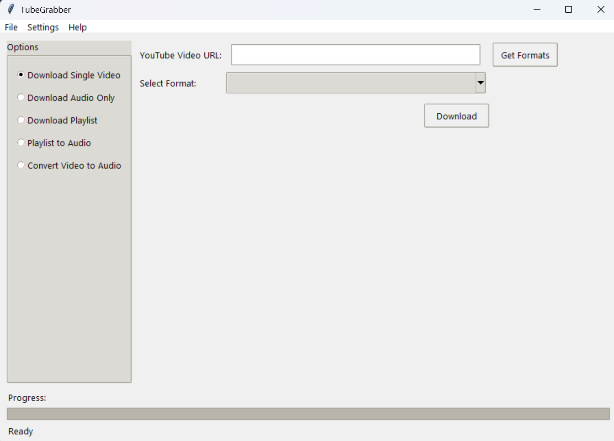
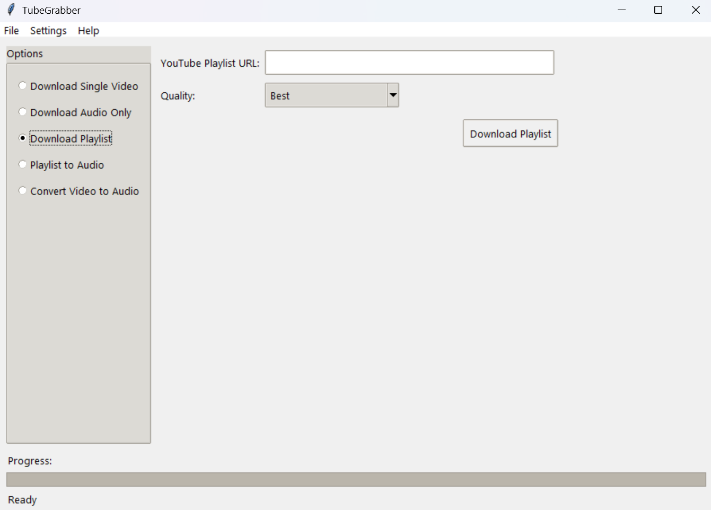

# TubeGrabber

A versatile YouTube downloader application built with Python and Tkinter that allows you to download videos, audio, and playlists with an easy-to-use graphical interface.

> **Educational Notice**: This application is created for educational purposes only. It demonstrates Python GUI development, threading, subprocess management, and media handling. Users should respect copyright laws and YouTube's Terms of Service when using this application. Only download content you have permission to access and use.

## About TubeGrabber

TubeGrabber is an educational Python project that demonstrates practical applications of several advanced programming concepts in a real-world context. This application showcases:

### Technical Learning Aspects

- **Modern Python Development**: Utilizing Python's object-oriented capabilities, file handling, and error management
- **GUI Programming**: Implementation of responsive user interfaces with Tkinter and ttk
- **Multithreading**: Managing concurrent operations while maintaining UI responsiveness
- **Subprocess Management**: Properly handling external process execution and monitoring
- **Media Processing**: Working with multimedia streams, formats, and conversion techniques
- **Configuration Management**: Persistent settings storage and retrieval
- **Progress Tracking**: Real-time feedback mechanisms for long-running operations

### Educational Purpose

This project was created as a learning tool to help understand complex programming concepts in an engaging way. It demonstrates how to integrate multiple technologies into a cohesive application:

1. **yt-dlp** - For understanding API integration with third-party libraries
2. **FFmpeg** - For learning media transcoding fundamentals
3. **Tkinter** - For exploring desktop application development
4. **Threading** - For implementing non-blocking operations

### Responsible Use Notice

This software is provided strictly for educational purposes. Users are responsible for complying with applicable laws and terms of service agreements when using this application. Always respect copyright and only download content you have permission to access and use.

### For Students and Developers

TubeGrabber serves as an excellent reference for intermediate Python programmers looking to build practical skills in desktop application development, media handling, and creating user-friendly interfaces. The codebase is structured to be readable and well-documented, making it an ideal learning resource.

## Features

- **Single Video Download**: Download YouTube videos in various formats and qualities
- **Audio Extraction**: Extract audio from YouTube videos directly as MP3
- **Playlist Support**: Download entire YouTube playlists with progress tracking
- **Audio Playlist**: Convert all videos in a playlist to MP3 format
- **Local Video Conversion**: Convert local video files to MP3 audio
- **Format Selection**: Choose from available video formats and qualities
- **Multi-threaded Downloads**: Fast playlist downloads with concurrent processing
- **Progress Tracking**: Real-time progress display with speed and ETA information
- **Dark Mode**: Toggle between light and dark interface themes
- **Configurable Settings**: Customize retry attempts and download directory
- **Persistent Settings**: Your preferences are saved between sessions

## Screenshots




## Requirements

- Python 3.6+
- FFmpeg (for audio extraction and video conversion)
- Required Python packages (see requirements.txt):
  - yt-dlp
  - ffmpeg-python
  - pydub
  - tkinter (included with Python)

## Installation

1. Clone this repository:

   ```bash
   git clone https://github.com/Tertho1/TubeGrabber.git
   cd TubeGrabber
   ```

2. Install required dependencies:

   ```bash
   pip install -r requirements.txt
   ```

3. Install FFmpeg:

   - **Windows**: Download from [ffmpeg.org](https://ffmpeg.org/download.html) and add to PATH
   - **macOS**: `brew install ffmpeg`
   - **Linux**: `sudo apt install ffmpeg` or equivalent for your distro

4. Run the application:
   ```bash
   python main.py
   ```

## Usage

### Downloading a Single Video

1. Select "Download Single Video" from the options panel
2. Enter the YouTube video URL
3. Click "Get Formats" to retrieve available formats
4. Select your preferred format from the dropdown
5. Click "Download" to start the download process

### Downloading Audio Only

1. Select "Download Audio Only" from the options panel
2. Enter the YouTube video URL
3. Click "Download Audio" to extract and save the audio as MP3

### Downloading a Playlist

1. Select "Download Playlist" from the options panel
2. Enter the YouTube playlist URL
3. Select your preferred quality (Best, Medium, Low)
4. Click "Download Playlist" to start downloading all videos

### Downloading a Playlist as Audio

1. Select "Playlist to Audio" from the options panel
2. Enter the YouTube playlist URL
3. Click "Download Playlist as Audio" to download all videos as MP3

### Converting Local Video to Audio

1. Select "Convert Video to Audio" from the options panel
2. Click "Browse" to select a local video file
3. Click "Convert to Audio" to extract the audio track as MP3

## Customization

- **Download Directory**: Change the default download location under File → Downloads → Set Download Directory
- **Temp Directory**: Set a custom temporary directory under File → Downloads → Set Temp Directory
- **Retry Settings**: Configure maximum retry attempts under Settings → Retry Settings
- **Theme**: Toggle Dark Mode under Settings → Dark Mode

## License

This project is licensed under the MIT License - see the LICENSE file for details.

## Acknowledgments

- [yt-dlp](https://github.com/yt-dlp/yt-dlp) - The core library used for downloading YouTube content
- [FFmpeg](https://ffmpeg.org/) - Used for audio extraction and video processing
- [Tkinter](https://docs.python.org/3/library/tkinter.html) - Python's standard GUI package

## Contributing

Contributions are welcome! Please feel free to submit a Pull Request.
